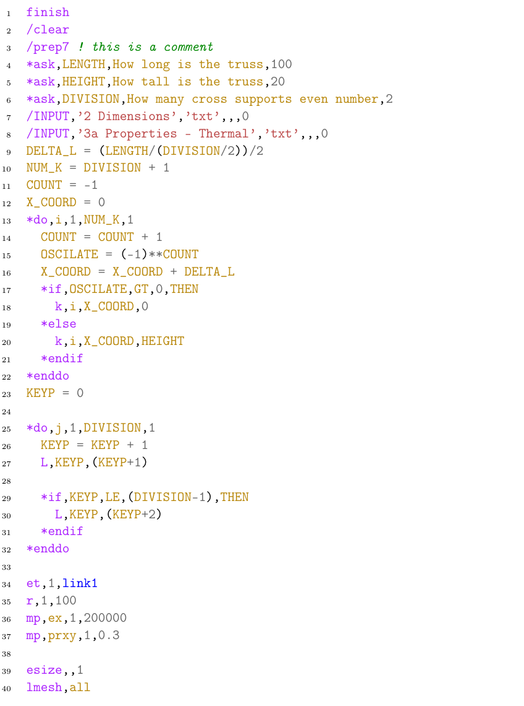

# ANSYS and gcode lexers of pygments
######UPDATE#####
This repository is now officially part of pygments 2.9

Anyone who wants to add these lexers to pygments please feel free to do so.
I just didn't do it myself because I don't want to create an account on Bitbucket. Please inform me of any bugs/errors since I'm fairly new to Python.

Example

ansys APDL lexer info:
- based on fortran lexer
- based on https://github.com/dieter-wilhelm/ansys-mode

Installation in Linux 

 1- Copy files to /usr/lib/python2.7/dist-packages/pygments/lexers

 2- Run in that directory "sudo python _mapping.py"

 3- Enjoy!
